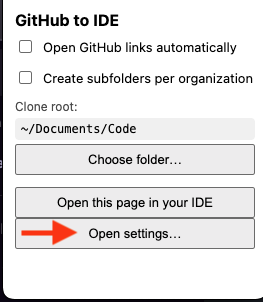
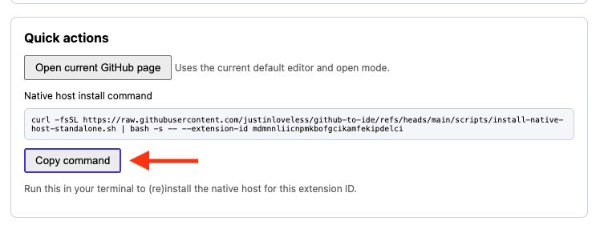

# GitHub to IDE

GitHub to IDE intercepts GitHub links and sends them straight to the IDE of your choice. It works in any Chromium-based browser (Chrome, Arc, Brave, Chromium, etc.) and supports multiple editors (VS Code, Rider, Cursor out of the box).

## Quick install

1. **Clone the repository**
   ```bash
   git clone https://github.com/justinloveless/github-to-ide.git
   cd github-to-ide
   ```

2. **Load the extension (unpacked)**
   1. Enable Developer Mode at `chrome://extensions` (or the equivalent URL in Arc/Brave).
   2. Click **Load unpacked** and choose the `extension/` folder inside this repository.
   
   *Optional:* run `./scripts/package-extension.sh` to produce a ZIP in `dist/` that you can share with teammates. They must still extract that ZIP and choose the extracted folder with **Load unpacked**—Chrome will not load the ZIP directly.

3. **Install the native host**
   - **Option A (know your extension ID):**
     1. From `chrome://extensions`, copy the extension ID.
     2. Run:
        ```bash
        curl -fsSL https://raw.githubusercontent.com/justinloveless/github-to-ide/refs/heads/main/scripts/install-native-host-standalone.sh | \
          bash -s -- --extension-id <extension-id>
        ```
   - **Option B (no typing required):**
     1. Open the extension options page.
     2. At the bottom you’ll see a ready-to-copy command populated with *your* extension ID.
        <p align="center">
          
        </p>
     3. Click **Copy command** (or copy manually) and paste into your terminal.
        <p align="center">
          
        </p>

   The script downloads the native helper to `~/.github-to-ide/native-host` and writes the manifest for Chrome/Arc/Brave/Chromium/Vivaldi.

4. **Configure**
   - Open the extension options page (`chrome://extensions` → Details → Extension options).
   - Tweak clone root, default editor/open mode, and review per-repository overrides. The options screen shows the exact install command (with your extension ID) so you can re-run it later if needed.

> Tip: the popup menu also has a direct link to the options page.

## Scripts

- `scripts/package-extension.sh` – packages the extension into `dist/github-to-ide-<timestamp>.zip` for easy sharing.
- `scripts/install-native-host.sh` – installs the native host from a local checkout (if you already cloned the repo).
- `scripts/install-native-host-standalone.sh` – downloads the latest host files from GitHub and writes the native messaging manifest (used by the curl one-liner above).

## Editors

- VS Code, JetBrains Rider, and Cursor are included by default. Add or edit entries via the options page – the configuration lives entirely in `chrome.storage`, so no manual JSON edits are needed.
- Changing the editor from the header dropdown stores a per-repository override. The options page lists every override and lets you clear them individually or all at once.
- The dropdown also selects the default *open mode* (workspace vs current file). Hold <kbd>Shift</kbd> while choosing an editor to perform the opposite mode once.

## Development scripts

- `scripts/install-native-host.sh` – install/update the native host using the files from your local checkout (handy while iterating).
- `native-host/run.sh` – launcher for the Node-based host (`native-host/index.js`).

## Notes

- Restart the browser after installing the native host so the manifest reloads.
- The project doesn’t bundle Node dependencies; only a recent Node runtime is required for the native helper.
- GitHub to IDE is not (yet) published in the Chrome Web Store; installation is manual via Developer Mode.
